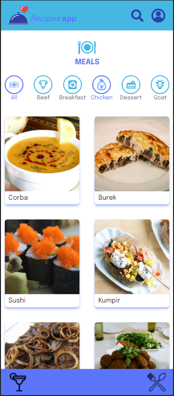
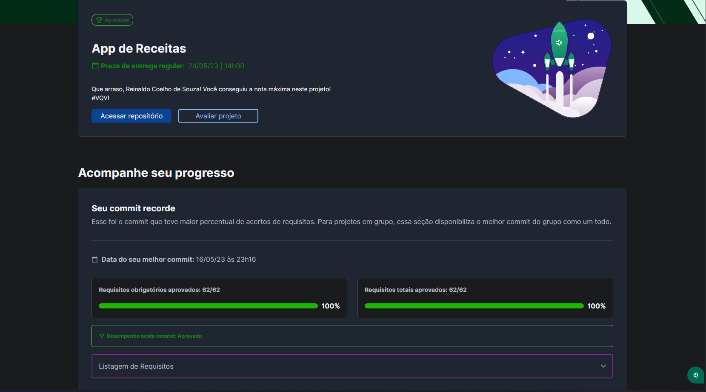
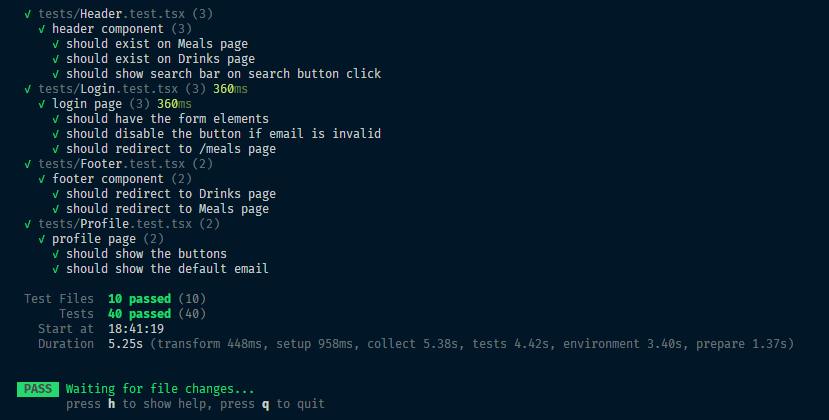

# 🥗 Recipes APP

Acesse [aqui](https://www.coelhoreinaldo.dev/recipes-app/).

## 📘 Sobre

Um aplicativo de receitas desenvolvido em React.js para dispositivos móveis. Nele, é possível encontrar diversas receitas de bebidas e comidas, visualizar instruções e ingredientes para prepará-las, marcar suas receitas favoritas e compartilhá-las com amigos e familiares.

Esta versão é uma refatoração da primeira versão desenvolvida em grupo, disponível [aqui](https://github.com/coelhoreinaldo/cook-script). Os principais objetivos dessa refatoração foram o aprimoramento do código, a prática de TypeScript e TailwindCSS e a implementação de novas funcionalidades.

## 🧩 Funcionalidades

- Simulação de login;
- Acesso a uma variedade de receitas de comidas e/ou bebidas;
- Filtragem das receitas por tipo;
- Visualização detalhada de uma receita (ingredientes, instruções, vídeos explicativos);
- Início de uma receita e controle do progresso marcando os ingredientes utilizados;
- Finalização de uma receita;
- Adição de receitas aos favoritos;
- Visualização do perfil do usuário e acesso às receitas feitas e favoritadas.

## ⚛️ Ferramentas

O projeto foi construído utilizando as seguintes tecnologias:

- React.js com TypeScript;
- Tailwind CSS para estilização;
- Context API para gerenciamento de estado;
- Componentes Funcionais do React;
- React Router para navegação;
- React Hooks, incluindo useState, useEffect, useCallback, useMemo, etc;
- Requisições de API para obtenção de dados;
- Formulários em React;
- Testes com RTL, Jest e Vitest;
- Abordagem Mobile First para design responsivo;
- Metodologias Scrum e Kanban para gestão do projeto.

## 🛠️ Como executar o projeto?

1. Instalando dependências

`npm install`

2. Executando a aplicação

`npm run dev`

## 📝 Nota

## 🧪 Testes

Comando para executar os testes: `npm test`

## ©️ Copyright

Este projeto foi desenvolvido por mim e todos os direitos estão reservados. A pasta de mocks (/tests/mocks) foi inicialmente fornecida pela Trybe, e converti os arquivos para TypeScript para utilizá-los nos meus testes. Os assets foram providos pela Trybe e estavam disponíveis no protótipo do Figma.
